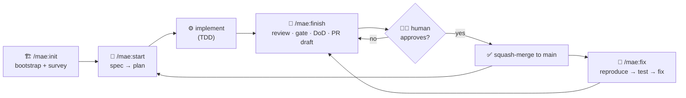

# mae — Managed Agentic Engineering

> A Claude Code plugin that turns "vibe coding" into a disciplined, spec-driven pipeline —
> the same one, for everyone on the team, enforced by hooks rather than hope.

**mae** (Managed Agentic Engineering) gives a project one small skill surface —
`/mae:init`, `/mae:start`, `/mae:finish`, `/mae:fix` — that carries every change from
**spec → plan → implementation → reviewed PR**, and scaffolds and maintains the project's
documentation as part of the same pipeline. Install it once; everyone who opens the repo
gets the identical workflow, the identical guardrails, and the identical definition of
"done".

It is **stack-agnostic**: mae scaffolds the engineering *process* (a constitution, always-on
rules, specs, a validator, permissions, optional CI/e2e) into any codebase — TypeScript,
PHP, or otherwise — and leaves the stack choices to you.

---

## Why mae exists

Agentic coding is fast and forgetful. Left alone, an agent loses the business goal,
re-invents what already exists, and calls a change "done" without evidence. mae is a thin
management layer that keeps the agent honest:

- **Two documents, never one.** `docs/constitution.md` is engineering **law**;
  `docs/PROJECT.md` is **business** context. Confusing them is the #1 way an agent drifts —
  so they stay separate, and a third document (`docs/architecture-map.md`) holds the
  structural map, stamped with the commit it reflects.
- **Documentation is true by definition.** The docs live in the repo and are maintained by
  the pipeline, in the same commit as the code. No external wiki to rot.
- **Depth is proportional to size.** Every change is sized and routed once; a trivial fix
  takes the light route, a large feature takes the full one. Steps are skipped only on an
  explicit N/A condition — and every skip is announced.
- **Ask when uncertain.** Design decisions belong to the human. mae interviews one question
  at a time, each with a recommended answer — it never dumps a blank page or a wall of
  questions.
- **Push and PR are human-only.** The agent prepares everything and then **stops**. A human
  presses the button.
- **Guaranteed, not suggested.** The rules that must hold are enforced by hooks
  (a destructive-command guard, a session contract), not left to the model's goodwill.

mae owns the SDD stages; it delegates *process discipline* (planning, execution, TDD,
debugging, verification, review) to the **superpowers** plugin at defined points.

---

## Requirements — the superpowers plugin

> **mae will not run without [superpowers](https://github.com/obra/superpowers).** It is a
> required companion: mae invokes `superpowers:*` skills for process discipline at defined
> stages. `/mae:init` checks for it on startup and stops with install instructions if it is
> missing.

Install superpowers first:

```
/plugin marketplace add obra/superpowers
/plugin install superpowers@claude-plugins-official
```

Then add this marketplace and install mae:

```
/plugin marketplace add otakoyi/mae      # or a local path to this repo
/plugin install mae@otakoyi
```

`/mae:init` scaffolds `.claude/settings.json` with **both** plugins enabled, so a colleague
opening the project gets both automatically.

---

## Quickstart

1. **`/mae:init`** — answer the interview (project state, stack, constitution, e2e/CI
   opt-ins). It scaffolds the SDD layer **and** surveys the project into `docs/PROJECT.md`
   + `docs/architecture-map.md`. Run once; re-run only to refresh.
2. **`/mae:start`** — author (or point at) a spec, plan it in Plan Mode, then implement it.
3. **`/mae:finish`** — review, run the quality gate, check the Definition of Done against
   the diff, update the docs, and draft the PR — then it **STOPS** (push and PR are yours).
4. **`/mae:fix`** — for a bug: reproduce it, lock it with a failing test, apply the smallest
   fix through the same gate, and record it.

---

## The four skills

| Skill | Role |
|---|---|
| **`/mae:init`** | Bootstrap or adopt a project (questionnaire): constitution, core rules, specs, validator, permissions — **then** survey the codebase → `docs/PROJECT.md` + `docs/architecture-map.md` (stamped with the commit). One-time; re-run to refresh. |
| **`/mae:start`** | Spec interview → recon → `spec-analyst` → Plan Mode → `specs/<feature>/plan.md`. |
| **`/mae:finish`** | Review loop → verification gate → test gate → DoD-vs-diff → docs → drafts a PR, then STOPS. |
| **`/mae:fix`** | Reproduce → failing test → smallest fix → same gate → record. |

---

## The workflow

High-level shape (the detailed version — every decision point, question, and branch — is in
**[WORKFLOW.md](./WORKFLOW.md)**):



📄 **[Open the full workflow diagram →](./WORKFLOW.md)** — the complete scheme with every
question, answer branch, and 🛑 stop-gate across all four skills.

---

## What `/mae:init` scaffolds

Into any project, mae lays down the engineering process — skipping any file that already
exists (re-runs show a diff instead of overwriting):

- **`docs/constitution.md`** — engineering law (stack lock, hard rules, Definition of Done).
- **`.claude/rules/`** — the always-on core rules: `engineering.md`, `testing.md`, `git.md`.
- **`docs/PROJECT.md`** + **`docs/architecture-map.md`** — the business and structural memory.
- **`specs/`** — the spec template and lifecycle; every feature starts as a spec.
- **`scripts/validate-workflow.mjs`** — checks the project's artifacts, links, and freshness.
- **`.claude/settings.json`** — permissions (deny/ask/allow) and both plugins enabled.
- **Optional:** `--e2e` (Playwright planner/runner + MCP) and `--ci` (a GitHub Actions gate).

---

## Agents (and their cost)

Heavy reading and adversarial critique run in subagents, so the main context stays focused
on decisions:

- **`spec-analyst`** (Opus) — reconciles the spec against the constitution/code, then
  adversarially attacks it, in one dispatch.
- **`code-reviewer`** (Opus) — the single source of pre-PR review criteria.
- **`test-runner`** (Haiku) — runs the quality gate faithfully; cheap, keeps noisy output
  out of the main context.
- **`e2e-planner` / `e2e-runner`** — optional, scaffolded only if you opt into e2e at init.

---

## Hooks — the guaranteed behavior

Two hooks make the non-negotiables *guaranteed*, not merely documented:

- **`guard`** (PreToolUse) — deterministically blocks destructive commands
  (`git push --force`, `git reset --hard`, `rm -rf`) and writes into protected paths
  (`.env*`, `secrets/`, `.claude/`, `.github/workflows/`, `docs/constitution.md`).
- **`session-start`** (SessionStart) — injects the workflow contract into every session and
  warns if the required superpowers plugin is missing.

---

## Updates

New releases roll out via `/plugin update`. Scaffolded files carry a version marker;
re-running `/mae:init` offers a per-file migration diff when the installed plugin is newer —
it never silently overwrites your work.

## Contributing

This repo **is** the mae plugin and dogfoods its own workflow. If you're working on the
plugin itself, start with **[AGENTS.md](./AGENTS.md)** (layout, the `pnpm check:plugin`
gate, and conventions).

## Feedback

Questions, bugs, ideas → `#mae-feedback`.

## License

MIT © Otakoyi Software.
