# mae — developer workflow

The full developer journey through the mae spec-driven workflow: every stage, decision
point, and answer branch across `/mae:init`, `/mae:start`, implementation, `/mae:finish`,
and `/mae:fix`. 🛑 = stop/refuse gate · 🧑‍⚖️ = human-only gate.

```mermaid
flowchart TD
    %% ================= SESSION / ENTRY =================
    S0(["👩‍💻 Developer opens the project in Claude Code"]) --> S1["SessionStart hook injects the<br/>using-mae workflow contract"]
    S1 --> S2{"superpowers plugin<br/>installed?"}
    S2 -- No --> S2a["⚠ Warning shown +<br/>install command<br/>/plugin install superpowers"]
    S2a --> S2
    S2 -- Yes --> ENTRY{"What do you want<br/>to do?"}

    ENTRY -- "Set up / adopt a project" --> I0
    ENTRY -- "Refresh a stale map" --> I0
    ENTRY -- "Build a feature" --> ST1
    ENTRY -- "Fix a bug" --> FX1

    %% ================= /mae:init =================
    subgraph INIT["🏗 /mae:init — bootstrap + survey (run ONCE, re-run to refresh)"]
        direction TB
        I0{"Gate: superpowers<br/>available?"}
        I0 -- No --> ISTOP["🛑 STOP — print install commands,<br/>scaffold nothing"]
        I0 -- Yes --> I1{"docs/architecture-map.md<br/>already exists?"}

        I1 -- "Yes (re-run)" --> IR1{"git diff since<br/>reflects_commit"}
        IR1 -- "empty" --> IRdone["Map is current → report & stop"]
        IR1 -- "≤ half modules" --> IRinc["Incremental re-survey of<br/>changed surfaces + re-stamp"]
        IR1 -- "> half modules" --> IRfull["Full re-scan"]
        IRinc --> IHAND
        IRfull --> IHAND

        I1 -- "No (fresh)" --> I2{"Depth dial?<br/>(reads .claude/sdd.local.md)"}
        I2 -- "easy" --> I3
        I2 -- "medium (default)" --> I3
        I2 -- "hard" --> I3

        I3{"Project state?"}
        I3 -- "Empty → greenfield" --> I4{"Generate a base<br/>project structure?"}
        I3 -- "Existing → brownfield" --> I5["Explore agent scans stack,<br/>layout, test/build cmds, docs"]
        I3 -- "Ambiguous" --> I3q["Ask which the user intends"] --> I3

        I4 -- "No" --> I6
        I4 -- "Yes → Preset framework" --> I4a["Official generator:<br/>Next / Nest / Node-lib / Laravel"]
        I4 -- "Yes → Free description" --> I4b["Draft structure proposal →<br/>create only after approval"]
        I4a --> I6
        I4b --> I6
        I5 --> I5r["Report FOUND vs ADDED<br/>(never overwrite w/o diff)"] --> I6

        I6["Constitution interview<br/>(one Q at a time):<br/>• stack lock<br/>• hard rules<br/>• Definition of Done"]
        I6 --> I7["Run scaffolder:<br/>scaffold.mjs --target ."]
        I7 --> I7q1{"E2E testing?"}
        I7q1 -- "Yes" --> I7e["+ --e2e (planner/runner + Playwright MCP)"]
        I7q1 -- "No" --> I7q2
        I7e --> I7q2{"CI enforcement?"}
        I7q2 -- "Yes" --> I7c["+ --ci (mae-checks.yml)"]
        I7q2 -- "No" --> I8
        I7c --> I8

        I8["Fill docs/constitution.md placeholders<br/>from the interview"]
        I8 --> I9["Survey → write docs/PROJECT.md<br/>(business context)"]
        I9 --> I10["Survey → write docs/architecture-map.md<br/>(structure + reflects_commit, evidence-only cmds)"]
        I10 --> I11{"Greenfield?"}
        I11 -- "Yes" --> I11a["Record foundation<br/>decision records + roadmap seed"]
        I11 -- "No" --> IHAND
        I11a --> IHAND
        IHAND["📋 Handoff: review constitution +<br/>PROJECT.md + architecture-map.md"]
    end

    IHAND --> ICLR["/clear"] --> ST1
    IRdone --> ENTRY

    %% ================= /mae:start =================
    subgraph START["🚀 /mae:start — per feature (ends at an approved plan)"]
        direction TB
        ST1{"Input is a spec path<br/>or free text?"}
        ST1 -- "Path: spec.md" --> ST1a{"4 sections present?<br/>task/idea/scenarios/DoD"}
        ST1a -- "No" --> ST1stop["🛑 Stop — ask user to<br/>complete the spec"]
        ST1a -- "Yes" --> ST2
        ST1 -- "Free text" --> ST1b["Interview: one Q at a time<br/>(name → task → idea →<br/>scenarios → DoD) → save spec"]
        ST1b --> ST2

        ST2{"Working tree clean?"}
        ST2 -- "No (dirty)" --> ST2stop["🛑 Stop — commit/stash first"]
        ST2 -- "Yes" --> ST3["Update base (fetch/checkout/pull)<br/>→ git checkout -b feat/NAME"]
        ST3 --> ST3q{"Keep current workspace<br/>untouched (parallel)?"}
        ST3q -- "Yes" --> ST3w["superpowers:using-git-worktrees"] --> ST4
        ST3q -- "No" --> ST4

        ST4{"Size & route? (one Q)<br/>XS·S·M·L·XL"}
        ST4 -- "XS/S → quick" --> ST5
        ST4 -- "M → standard" --> ST5
        ST4 -- "L/XL → full" --> ST5

        ST5["Recon: Explore agent →<br/>delta analysis w/ path:line"]
        ST5 --> ST6["spec-analyst: reconcile +<br/>adversarial pass → ranked questions"]
        ST6 --> ST7{"Non-trivial design?<br/>(new module/pkg/schema)"}
        ST7 -- "Yes" --> ST7a["Write a design note /<br/>decision record"] --> ST8
        ST7 -- "No (announce skip)" --> ST8

        ST8["Clarify: fold analyst's questions<br/>into interview (blockers first)"]
        ST8 --> ST8q{"Blockers resolved?"}
        ST8q -- "No" --> ST8
        ST8q -- "Yes" --> ST9["Plan Mode → superpowers:writing-plans"]
        ST9 --> ST9q{"Plan approved?<br/>(ExitPlanMode)"}
        ST9q -- "No" --> ST9
        ST9q -- "Yes" --> ST10["Persist specs/…/plan.md<br/>+ promote roadmap → Now"]
        ST10 --> ST11{"Big / parallelizable?"}
        ST11 -- "Yes (offer)" --> ST11a["superpowers:dispatching-parallel-agents"] --> IMPL
        ST11 -- "No" --> IMPL
    end

    %% ================= IMPLEMENTATION =================
    subgraph IMPL["⚙ Implementation (superpowers)"]
        direction TB
        IM1{"How to execute?"}
        IM1 -- "Recommended" --> IM1a["subagent-driven-development<br/>(fresh subagent per task)"]
        IM1 -- "Inline" --> IM1b["executing-plans<br/>(main context, checkpoints)"]
        IM1a --> IM2["test-driven-development:<br/>red → green → refactor"]
        IM1b --> IM2
    end
    IMPL --> FN1

    %% ================= /mae:finish =================
    subgraph FINISH["🏁 /mae:finish — review, gate, PR (STOPS before push)"]
        direction TB
        FN1["Pre-PR review: code-reviewer<br/>on git diff main...HEAD"]
        FN1 --> FN1q{"Blockers?"}
        FN1q -- "Yes" --> FN1a["Fix code → re-review"] --> FN1
        FN1q -- "No" --> FN2["Quality gate: test-runner<br/>lint → typecheck → test → build"]
        FN2 --> FN2q{"GREEN?"}
        FN2q -- "RED" --> FN2a["Fix code<br/>(never weaken/skip a test)"] --> FN2
        FN2q -- "GREEN" --> FN2e{"UI flow / route = full?"}
        FN2e -- "Yes (offer)" --> FN2ee["e2e-planner / e2e-runner"] --> FN3
        FN2e -- "No (skip, say so)" --> FN3

        FN3["Constitution gates (conditional):<br/>migrations reversible · changelog+semver ·<br/>secrets scan · decision records"]
        FN3 --> FN4{"Every DoD item met<br/>by the diff?"}
        FN4 -- "No" --> FN4a["🛑 Report unmet items —<br/>feature isn't done"]
        FN4 -- "Yes" --> FN5["Document: surface docs, changelog,<br/>features/SLUG.md, spec → done,<br/>roadmap → Shipped"]
        FN5 --> FN6["Commit (conventional subject,<br/>body = task desc, human author only)"]
        FN6 --> FN7{"Branch behind main?"}
        FN7 -- "Yes" --> FN7a["Offer git rebase origin/main<br/>(conflicts → hand back)"] --> FN8
        FN7 -- "No" --> FN8
        FN8["Draft PR from template +<br/>verification-before-completion"]
        FN8 --> FN9["🛑 STOP — show verdict/gate/DoD/PR draft"]
        FN9 --> FN9q{"Push + open PR?<br/>(human confirms)"}
        FN9q -- "No" --> FNhold["Hold — nothing pushed"]
        FN9q -- "Yes" --> FN10["git push → gh pr create<br/>(draft PR offered)"]
    end
    FN10 --> HUMAN

    %% ================= /mae:fix =================
    subgraph FIX["🐞 /mae:fix — per bug"]
        direction TB
        FX1{"Can you reproduce it?"}
        FX1 -- "No" --> FX1a["🛑 Refuse — can't fix<br/>what you can't reproduce"]
        FX1 -- "Yes" --> FX2["Trace symptom → the acceptance<br/>criterion it violates"]
        FX2 --> FX3["Write a FAILING test first<br/>(lock the bug — TDD)"]
        FX3 --> FX4{"Fix is a small patch,<br/>or needs a plan?"}
        FX4 -- "Needs plan/review" --> FX4a["⤴ Escalate to /mae:start"] --> ST1
        FX4 -- "Small patch" --> FX5["Smallest change → test goes green"]
        FX5 --> FX6["Same gate as finish (test-runner)"]
        FX6 --> FX7["Patch the spec + record<br/>_fixes/DATE-SLUG.md"]
    end
    FX7 --> HUMAN

    %% ================= HUMAN GATE / LOOP =================
    HUMAN["🧑‍⚖️ Human review required:<br/>CI green · 1 reviewer · rebased · threads resolved"]
    HUMAN --> MERGE{"Approved?"}
    MERGE -- "No" --> RECV["superpowers:receiving-code-review<br/>→ address feedback"] --> FN1
    MERGE -- "Yes" --> DONE["✅ Squash-merge to main"]
    DONE --> NEXT{"More work?"}
    NEXT -- "Next feature" --> ST1
    NEXT -- "Next bug" --> FX1
    NEXT -- "Done" --> SHIP(["🎉 Shipped"])

    %% ================= STYLES =================
    classDef stop fill:#7f1d1d,stroke:#ef4444,color:#fff;
    classDef human fill:#1e3a5f,stroke:#60a5fa,color:#fff;
    classDef done fill:#14532d,stroke:#22c55e,color:#fff;
    class ISTOP,ST1stop,ST2stop,FN4a,FX1a,FNhold stop;
    class HUMAN,MERGE,FN9,FN9q human;
    class DONE,SHIP,IRdone done;
```

