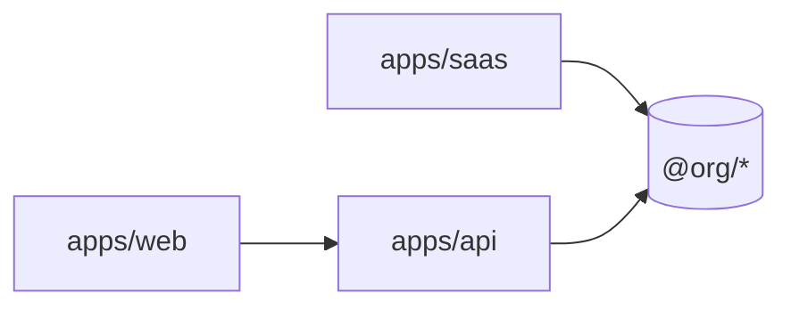

<!--
architecture-map.md TEMPLATE — copy to docs/architecture-map.md, generated/refreshed
by /mae:explore. This is the STRUCTURAL map: surfaces, boundaries, and the
machine-readable commands every later stage reads. It is NOT the business context
(that is docs/PROJECT.md) and NOT the hard rules (docs/constitution.md).

Two things make this file trustworthy:
  1. `reflects_commit` — the commit this map describes. Enables stale-detection and
     incremental refresh (git diff <reflects_commit>..HEAD).
  2. machine keys filled from EVIDENCE ONLY — a real script/config/lockfile. No proof
     → leave the value "" (empty). NEVER guess; a wrong command poisons every stage.
Delete this comment block in the real file.
-->

---
reflects_commit: ""        # git rev-parse HEAD at survey time
surveyed_at: ""            # yyyy-mm-dd
test_cmd: ""               # e.g. "pnpm test" — only if a real script exists
lint_cmd: ""               # e.g. "pnpm lint"
typecheck_cmd: ""          # e.g. "pnpm typecheck"
build_cmd: ""              # e.g. "pnpm build"
migration_tool: ""         # e.g. "prisma" — only with proof in the repo
frontend: ""               # e.g. "next" — only with proof
---

# Architecture map

> Reflects commit `<sha>` (`surveyed_at`). Stale when
> `git diff --name-only <sha>..HEAD` is non-empty — re-run `/mae:explore`.

## Surface inventory

One row per app / package / module. Kind = app | package | module.

| Path | Kind | Role | Depends on | Consumed by |
|---|---|---|---|---|
| `apps/<name>` | app | <one line> | `@<org>/<pkg>` | — |
| `packages/<name>` | package | <one line> | — | `apps/<x>` |
| `modules/<name>` | module | <one line> | `@<org>/<pkg>` | `apps/<x>` |

## Boundaries that bite

The rules an agent must respect when moving between surfaces. Link `docs/constitution.md`
for the authoritative wording; state the practical consequence here.

- **Schema separation** — <the persistence-schema boundary and correlation rule>.
- **Tenancy** — <the isolation column and how it's enforced>.
- **Package ownership** — <what modules must consume, never re-implement>.

## Shape (for humans)

## Per-surface docs

This map is the index. Depth lives in the surface docs — do not duplicate them here.

- Apps → `docs/projects/<app>.md`
- Packages → `docs/packages/<pkg>.md`
