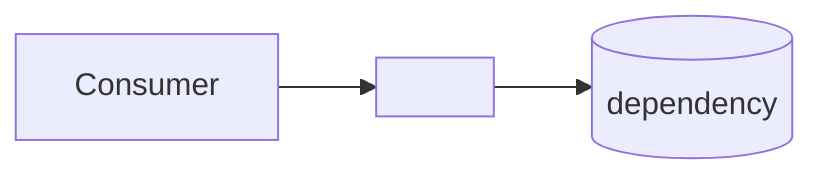

<!--
SERVICE DOC TEMPLATE — copy into docs/projects/<app>.md or docs/packages/<pkg>.md.
Contract (see ../conventions/documentation.md):
  - The mermaid diagram is FOR HUMANS — shape at a glance.
  - The "For the agent" prose is FOR AI — dense, literal, greppable facts.
  - Keep it SIMPLE and CURRENT. A stale doc is worse than none.
  - /mae:finish updates this file whenever a feature changes the surface.
Delete this comment block in real docs.
-->

# `<surface-name>` — <one-line role>

- **Kind:** project (app) | package | module
- **Path:** `apps/<name>` | `packages/<name>` | `modules/<name>`
- **Status:** skeleton | in progress | stable
- **Depends on:** `@<org>/<pkg>`, … (internal) · <external: Postgres, Redis, S3, Stripe…>
- **Consumed by:** `apps/<x>`, `modules/<y>`, … (who imports/calls this)

## Diagram (for humans)

## For the agent (facts, literal)

<Dense prose an agent reads before touching this surface. State the truths that
change how code is written here — not marketing. Cover, in order:>

- **What it owns / does not own.** The boundary. What belongs here vs a sibling.
- **Public surface.** Key exports / routes / procedures / entry files, as paths.
- **Data.** Persistence schema, owned tables, tenancy column.
- **Auth.** Which auth instance, which roles/guards apply.
- **Boundaries & rules.** Constitution rules that bite here (validation boundaries, no
  cross-schema FK, no re-implementing a shared package, activation via config).
- **Gotchas.** Non-obvious wiring, failure modes, ordering constraints.

## Key files

| Path | Purpose |
|---|---|
| `…` | … |

## Changelog (features that shaped this surface)

- `<yyyy-mm-dd>` `feat: …` — one line. Link `../features/<slug>.md` if present.
